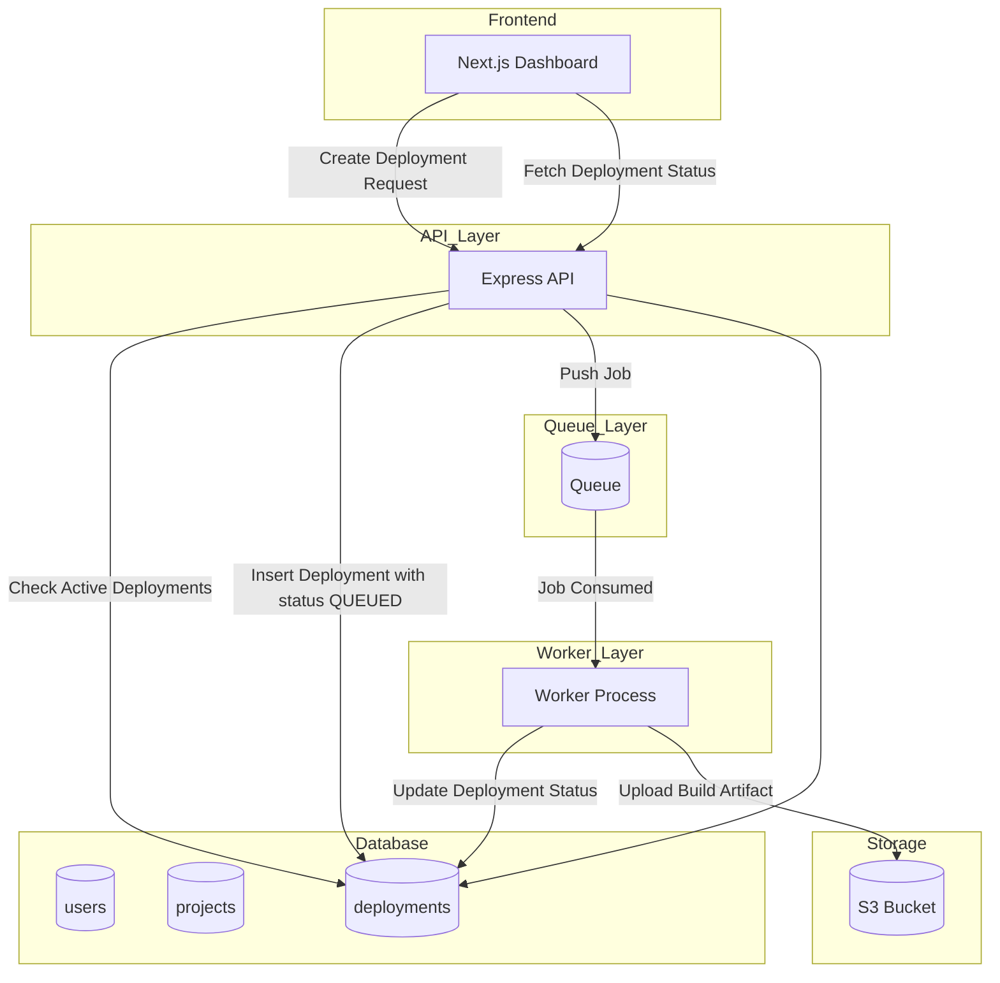
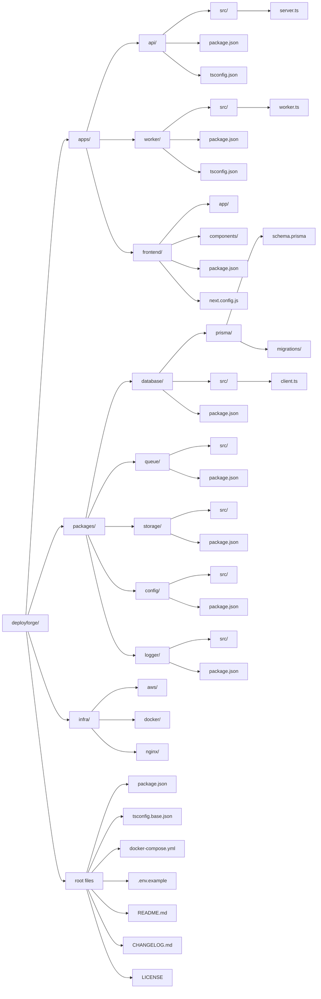
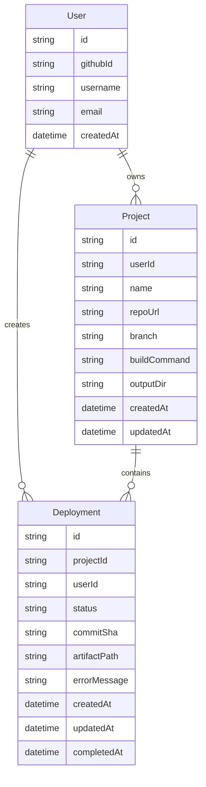

# DeployForge

> **Production-grade, distributed build and deployment platform for frontend engineers.**

DeployForge bridges the gap between static code and global availability. It is architected to behave like a distributed system, ensuring clear separation of concerns, reliable lifecycle management, and high observability.

---

## 📚 Documentation

- [**System Architecture**](#-system-architecture) - Deep dive into the distributed flow.
- [**Project Structure**](#-project-structure) - Overview of the monorepo layout.
- [**Contributing Guidelines**](CONTRIBUTING.md) - How to get started and technical standards.
- [**Security Policy**](SECURITY.md) - How to report vulnerabilities.
- [**Changelog**](CHANGELOG.md) - Version history and tracking.

---

## 🏗 Core Architecture Principles

- **Separation of Concerns**: The API (Control Plane) and Worker (Execution engine) are strictly separated runtimes.
- **Queue-Based Processing**: All build jobs are handled asynchronously via a pull-based queue system (Redis or SQS).
- **Stateless Workers**: Workers are ephemeral and idempotent. They fetch state from the DB and push build artifacts to S3.
- **Artifact Immutability**: Every deployment creates a unique, immutable path in S3. Overwriting is strictly prohibited.
- **Observability**: Centralized logging via a shared logger package and real-time status tracking in the DB.

## 🏗 System Architecture

The following diagram illustrates the distributed flow of a deployment job from the Frontend to S3 Artifact storage.

---

## 📁 Project Structure

DeployForge is a **TypeScript Monorepo** using **npm workspaces**.

### 📱 Applications (`/apps`)
- **`api/`**: The Control Plane.
    - `src/routes/`: Express/Fastify route definitions.
    - `src/controllers/`: Request handling and validation logic.
    - `src/services/`: Business logic (e.g., job queuing, limit enforcement).
    - `src/middleware/`: Auth (GitHub OAuth) and security guards.
    - `server.ts`: API entry point.
- **`worker/`**: The Execution Engine.
    - `src/lifecycle/`: Handles state transitions (Cloning -> Building -> Uploading).
    - `src/jobs/`: Queue polling and job processing logic.
    - `src/services/`: External integrations (S3, Git).
    - `worker.ts`: Worker process entry point.
- **`frontend/`**: The Dashboard (Next.js).
    - Built with the App Router, communicating exclusively with the API.

### 📦 Shared Packages (`/packages`)
- **`database/`**: Prisma ORM foundation. Exports a singleton Prisma client to prevent connection exhaustion.
- **`queue/`**: Abstraction layer for Redis/SQS with explicit `createProducer()` and `createConsumer()` roles.
- **`storage/`**: S3 integration for immutable artifact storage.
- **`logger/`**: Standardized JSON logging for cross-service consistency.
- **`config/`**: Centralized, schema-validated environment variable management.

### 🛠 Infrastructure (`/infra`)
- **`docker/`**: Service Dockerfiles.
- **`nginx/`**: Reverse proxy and load balancing configurations.
- **`aws/`**: Terraform/CloudFormation or IAM/S3 policy templates.

---

## �️ Database Schema

DeployForge uses PostgreSQL (hosted on Supabase) with Prisma ORM. The schema enforces referential integrity and tracks the complete deployment lifecycle.

---

## �🔄 Deployment Lifecycle

Deployments move through a strict state machine to ensure reliability and user-level concurrency control:

1.  **QUEUED**: Job created in DB and pushed to queue.
2.  **CLONING**: Worker pulls job and clones the GitHub repository.
3.  **INSTALLING**: Running `npm install` or equivalent.
4.  **BUILDING**: Executing the build command.
5.  **UPLOADING**: Syncing build output to S3.
6.  **DEPLOYED**: Final terminal state.

*Failure or cancellation results in a **FAILED** or **CANCELLED** state, freeing up a concurrency slot.*

---

## 🛡 Security & Guardrails

DeployForge is designed for safe execution:
- **Concurrency Limits**: Each user is limited to **2 active deployments** at a time.
- **Build Timeouts**: Hard limits (e.g., 5-7 minutes) to prevent runaway processes.
- **Resource Constraints**: Repository size limits and output size validation during building.
- **Stateless Execution**: Workers clean up temporary disk space after every job.

---

## 🚀 Local Development

1.  **Install dependencies**: `npm install`
2.  **Setup Environment**: `cp .env.example .env` (Update with your Supabase/AWS/Redis credentials)
3.  **Start Infrastructure**: `docker-compose up -d` (Starts Redis for the queue)
4.  **Launch Services**:
    - Build: `npm run build`
    - API: `npm run dev:api`
    - Worker: `npm run dev:worker`
    - Frontend: `npm run dev:frontend`

---

## 📄 License
Licensed under the [MIT License](LICENSE).
